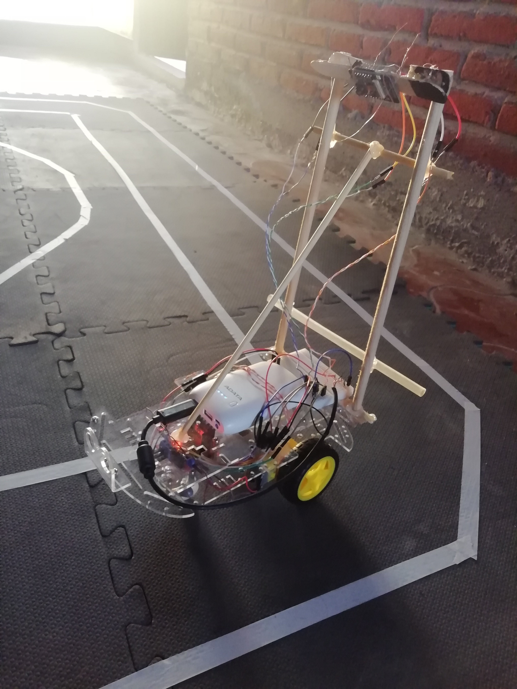
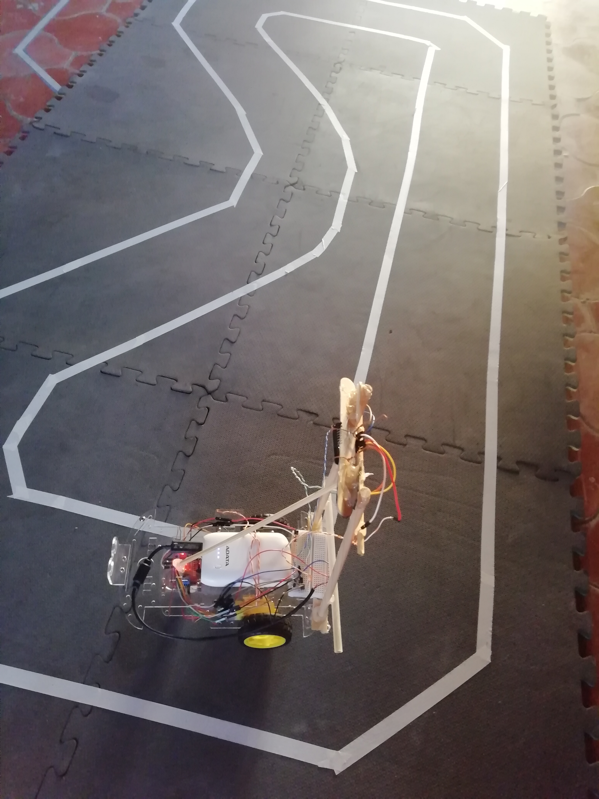
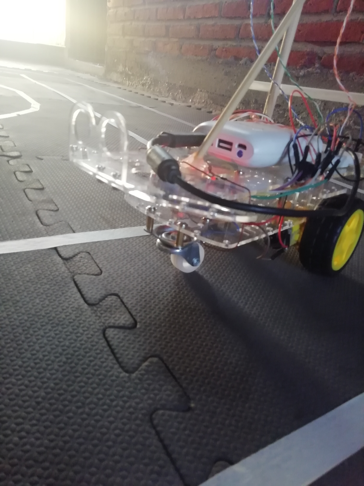
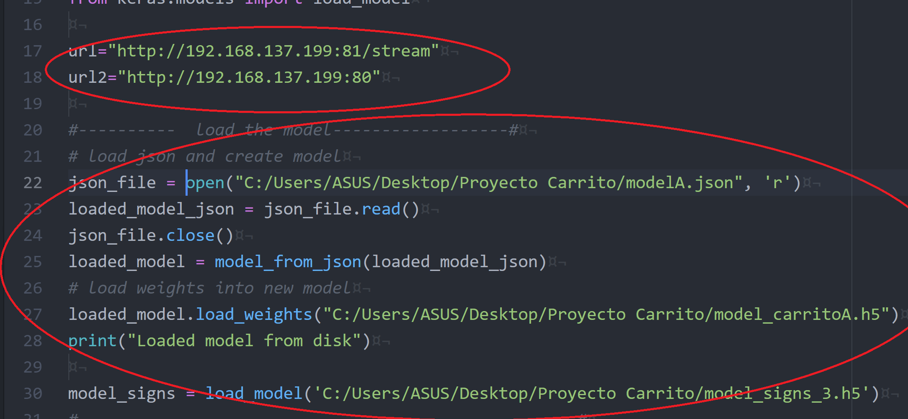

# Self-Driving-Car-Applied-Deep-Learning  
### This is a prototype of an autonomous car in which deep learning is applied and is controlled by the esp32-CAM board
#### The car is able to identify roads and traffic signs and make decisions according to how it is trained using neural networks and convolutional neural networks using the keras and tensorflow libraries.
 

### Videos  
finding lanes video:  
https://twitter.com/Gabrich888/status/1250179099877756929    
Speed increase and decrease video:   
https://twitter.com/Gabrich888/status/1254627071273435137    
Traffic signs video:  
https://twitter.com/Gabrich888/status/1249096816571953152     
  

 

### How does it work?  

The ESP32-CAM board has a network card that is used to connect it to the laptop, in this way signals (steering wheel addresses) are sent from the laptop to the car and at the same time the car (esp32) sends the images that are going capturing on the way.
When the laptop obtains these images, it processes them in the neural network and the output of this network is a prediction of the direction the car will take.

The repository contains all the code used, the programming part of the esp board is located in the "ESP32 files" folder.
The training part and autonomous mode are in the "python files" folder. the 2 training files are .ipynb to open in jupyter or google colab.

The "autonomous_mode.py" file has the esp32 ip in the first circle of the next image, you have to change the ip in the code the times that the ip is changed to esp32
  You also have to change all the routes, where you get images, and the models because these are local routes of my computer.

